# 2. 使用自由画布

## 使用工具栏

### 👆 选择工具
> 点击选择工具，在画布上点击并拖动即可选择图形（待实现），目前功能为防止误触绘图或者添加模块。
> 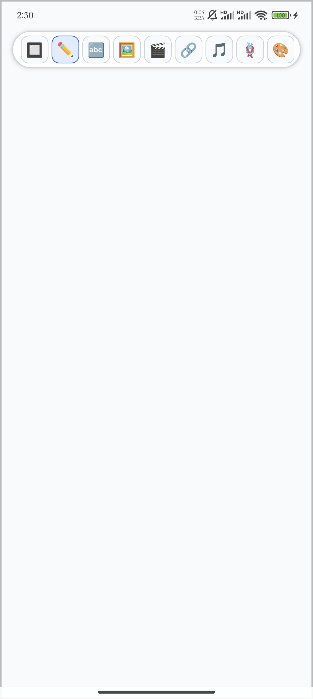

### 🖊️ 画笔工具（默认）
> 点击画笔工具，在画布上点击并拖动即可绘制图形。
> 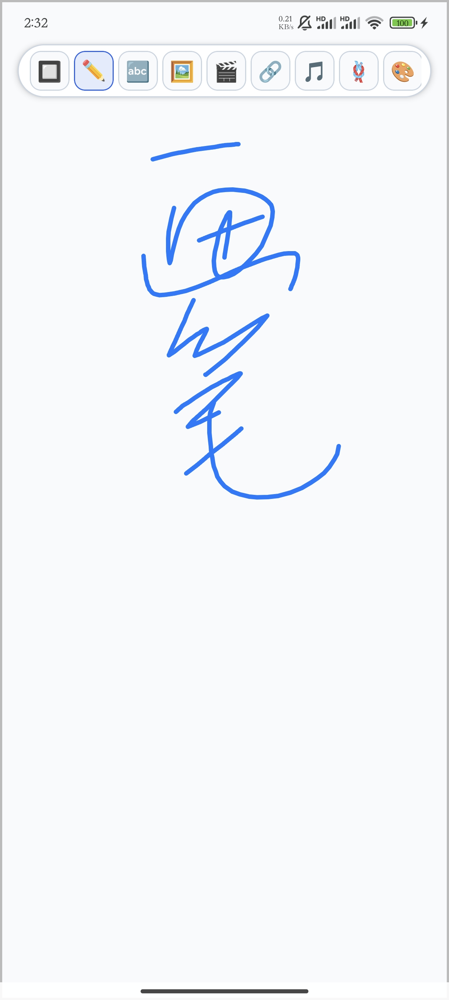

### 🔤 文本工具
> 点击文本工具，在画布上点击即可添加文本。
> 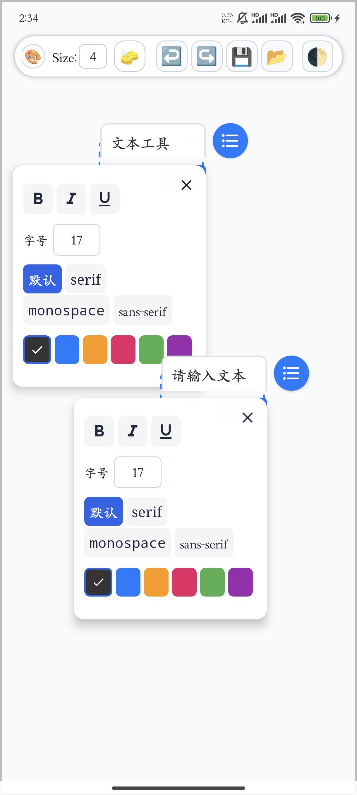

### 🖼️ 图片工具
> 点击图片工具，在画布上点击即可添加本地图片。
> 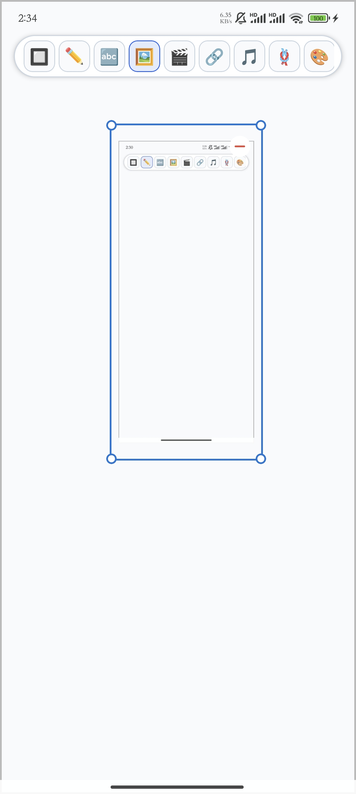

### 🎬 视频工具
> 点击视频工具，在画布上点击即可添加本地或网络视频。
> 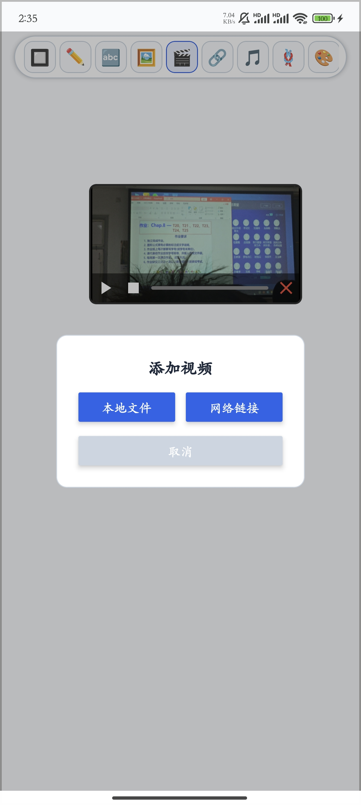

### 🔗 网页链接工具
> 点击网页链接工具，在画布上点击即可添加网页链接。
> 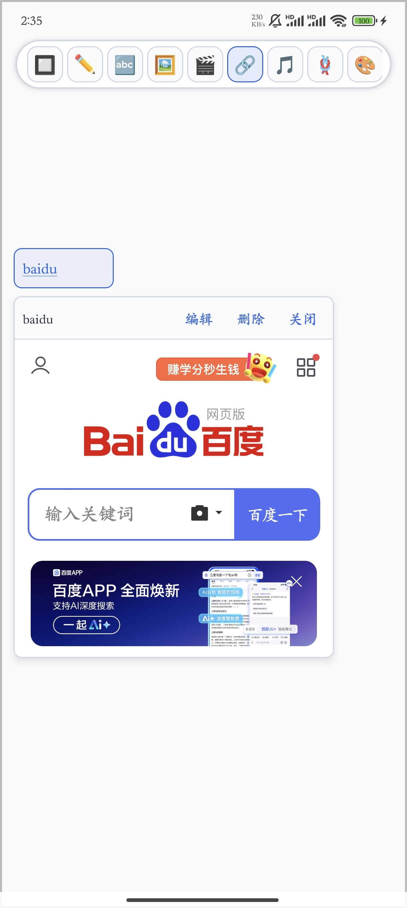

### 🎵 音频工具
> 点击音频工具，在画布上点击即可添加本地或网络音频。
> 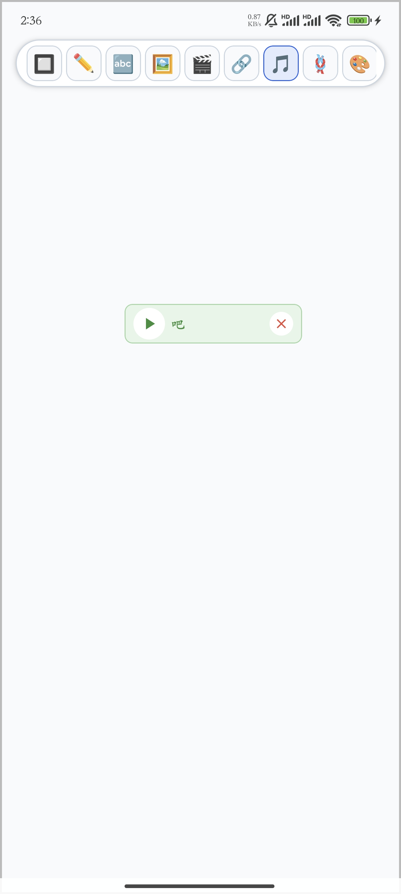

### 🪢 节点连接工具
> 点击节点连接工具，选择两个画布节点即可连接起来形成关系。
> 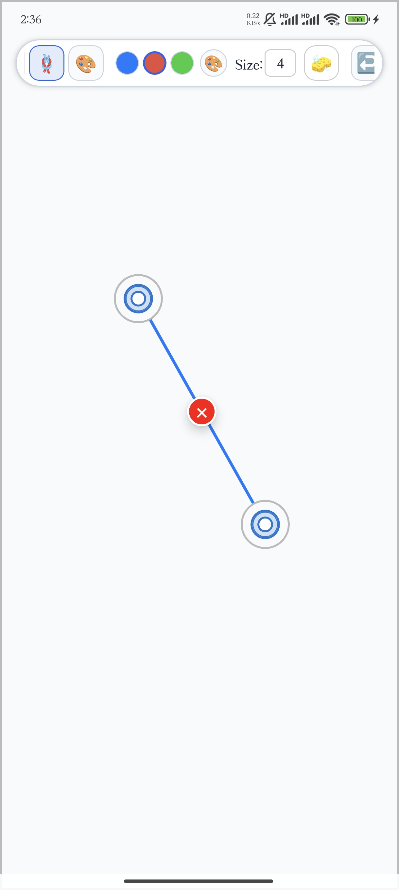

### 🎨 颜色选择和颜色自定义工具（用于绘图与节点连接）
> 提供了三种常用颜色选择，三种颜色右侧的按钮可以选用自定义颜色。
> 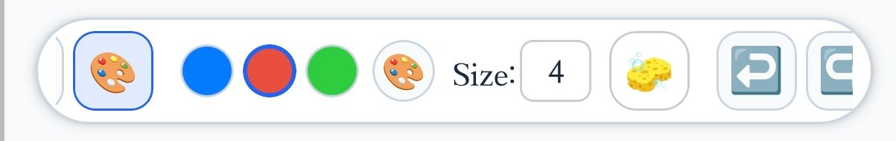

### ➖ 线条粗细更改工具（用于绘图与节点连接）
> Size: 输入框中可以输入修改线条粗细。
> 

### 🧽 橡皮擦工具
> 点击橡皮擦工具，在画布上点击并拖动即可擦除图形。
> 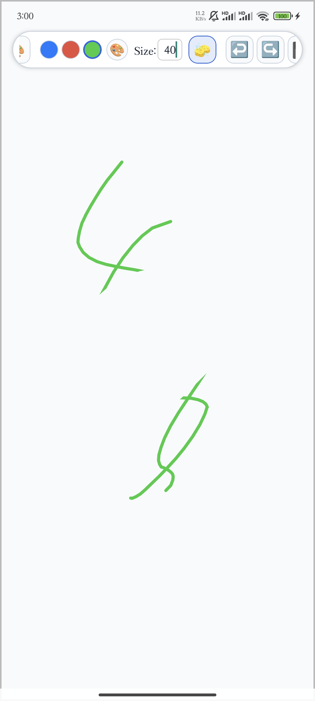

### ❌ 删除工具（待实现）
> 点击删除工具，在画布上点击即可删除选中的图形。

### ↩️ 撤销工具
> 点击撤销工具，可以撤销上一步操作。
> 

### ↪️ 重做工具
> 点击重做工具，可以重做上一步被撤销的操作。
> 

### 🗑️ 清空画布工具（待实现）
> 点击清空画布工具，可以清空画布上的所有图形。

### 💾 保存工具
> 点击保存工具，可以将画布上的图形保存为图片。
> 

### 📥 导入工具（待实现）
> 点击导入工具，可以导入画布到画布上。

### 🌗 主题工具
> 点击主题工具，可以切换画布的主题。
> 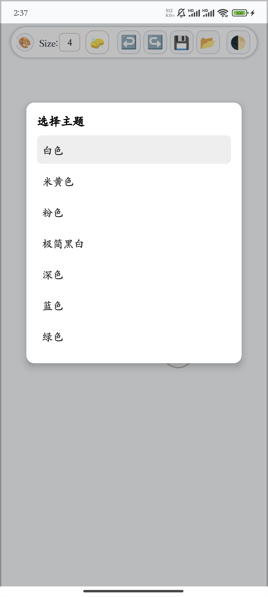
